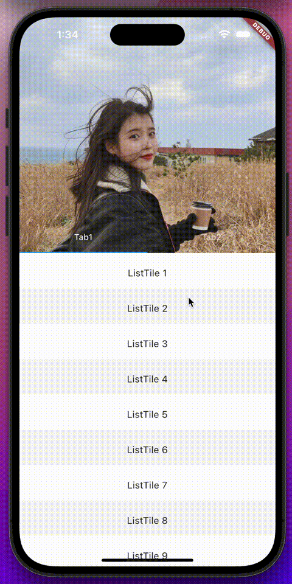

# nested_scroll_view_plus

An enhanced NestedScrollView with support for overscrolling for both the inner and outer scrollviews.

## 🔥 Preview



Try it online: [https://flutter-nested-scroll-view-plus.vercel.app](https://flutter-nested-scroll-view-plus.vercel.app)

## 💡 Usage

Installation:

```shell
flutter pub add nested_scroll_view_plus
```


Example usage:

1. Wrap your `SliverAppBar` with `OverlapAbsorberPlus`
2. Use `OverlapInjectorPlus` on top of your inner `CustomScrollView`
3. Change the physics of `CustomScrollView` to `AlwaysScrollableScrollPhysics`

That's it!

```dart
import 'package:nested_scroll_view_plus/nested_scroll_view_plus.dart';

NestedScrollViewPlus(
  headerSliverBuilder: (context, innerScrolled) => <Widget>[
    // 1. Wrap your SliverAppBar with OverlapAbsorberPlus
    OverlapAbsorberPlus(
      sliver: SliverAppBar(), // Your SliverAppBar
    ),
  ],
  body: TabBarView(
    children: [
      CustomScrollView(
        // 2. [IMPORTANT] Change the physics of CustomScrollView to AlwaysScrollableScrollPhysics
        physics: const BouncingScrollPhysics(
          parent: AlwaysScrollableScrollPhysics(),
        ),
        slivers: <Widget>[
          // 3. Use OverlapInjectorPlus on top of your inner CustomScrollView
          OverlapInjectorPlus(),
          // Other children of CustomScrollView
          // ...,
        ],
      ),
    ],
  ),
);
```

For additional examples, please visit the [scroll_master](https://github.com/idootop/scroll_master) repository. It includes features such as pull-to-refresh for `NestedScrollView`, combined scrolling for scrollview and tabview, and more.

## 📒 Others

### ⚙️ Accessing the Inner or Outer Scroll Controller

To access the inner or outer scroll controller of a `NestedScrollViewPlus`, you can use a `GlobalKey<NestedScrollViewStatePlus>` to get its state.

```dart
class _ExampleState extends State<Example> {
  // 1. Create a GlobalKey
  final GlobalKey<NestedScrollViewStatePlus> myKey = GlobalKey();

  @override
  Widget build(BuildContext context) {
    return NestedScrollViewPlus(
      // 2. Set the key to NestedScrollViewStatePlus
      key: myKey,
      // ...,
    );
  }

  @override
  void initState() {
    super.initState();
    WidgetsBinding.instance.addPostFrameCallback((timeStamp) {
      // 3. Access the inner or outer scroll controller using GlobalKey<NestedScrollViewStatePlus>
      myKey.currentState!.innerController.addListener(_handleInnerScroll);
      myKey.currentState!.outerController.addListener(_handleOuterScroll);
    });
  }

  void _handleInnerScroll() {
    final innerController = myKey.currentState!.innerController;
    if (innerController.positions.length == 1) {
      print('Scrolling inner nested scrollview: ${innerController.offset}');
    }
  }

  void _handleOuterScroll() {
    final outerController = myKey.currentState!.outerController;
    if (outerController.positions.length == 1) {
      print('Scrolling outer nested scrollview: ${outerController.offset}');
    }
  }
}
```

### 🚩 Preserve Scroll Positions of Inner CustomScrollViews

To preserve the scroll positions of inner `CustomScrollViews`, you can add a `PageStorageKey` to the `CustomScrollView` widget. Here's an example:

```dart
CustomScrollView(
  key: PageStorageKey<String>('unique-key'),
  slivers: <Widget>[
    // ...,
  ],
),
```

By assigning a unique key to the `CustomScrollView`, Flutter's `PageStorage` mechanism will store and restore the scroll position of the inner `CustomScrollViews`, allowing you to maintain the scroll positions even when the widget tree is rebuilt.

### ⭕️ For Older Flutter Versions

If you are using an older version of Flutter, please follow these steps to install the appropriate branch from the [old git repository](https://github.com/idootop/custom_nested_scroll_view).

```shell
dependencies:
  custom_nested_scroll_view:
    git:
      url: https://github.com/idootop/custom_nested_scroll_view.git
      # Choose the branch based on your local Flutter version
      ref: flutter-3.7
```

The different branches support the following Flutter versions:

| Git branch      | Supported flutter versions       |
| --------------- | -------------------------------- |
| flutter-3.7     | >=3.7.0-13.0.pre                 |
| flutter-3.4     | >=3.4.0-27.0.pre <3.7.0-13.0.pre |
| flutter-3.4-pre | >=3.4.0-17.0.pre <3.4.0-27.0.pre |
| flutter-3.0     | >=2.12.0-4.0.pre <3.4.0-17.0.pre |
| flutter-2.x     | <2.12.0-4.0.pre                  |

For more details, please visit the [old documentation](https://github.com/idootop/custom_nested_scroll_view) for `CustomNestedScrollView`.

## ❤️ Acknowledgements

- [extended_nested_scroll_view](https://github.com/fluttercandies/extended_nested_scroll_view)
- [大道至简：Flutter 嵌套滑动冲突解决之路](https://vimerzhao.top/articles/flutter-nested-scroll-conflict/)
- [深入进阶-如何解决 Flutter 上的滑动冲突？ ](https://juejin.cn/post/6900751363173515278)
- [用 Flutter 实现 58App 的首页](https://blog.csdn.net/weixin_39891694/article/details/111217123)
- [不一样角度带你了解 Flutter 中的滑动列表实现](https://blog.csdn.net/ZuoYueLiang/article/details/116245138)
- [Flutter 滑动体系 ](https://juejin.cn/post/6983338779415150628)
